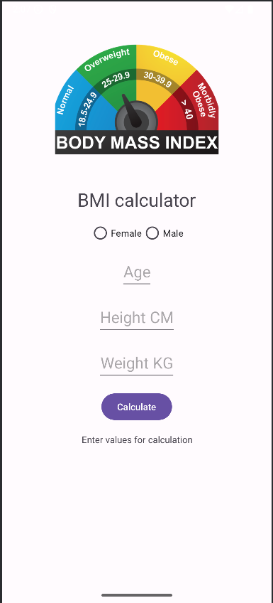

# BMI Calculator App

This is my first Android app — a simple **BMI (Body Mass Index) Calculator** built using **Java** and **Android Studio**.

## 📱 Features

- Enter your height and weight
- Calculate your BMI instantly

## 🛠️ Technologies Used

- Java
- Android Studio
- Android XML layouts
- ImageViews

## 📸 Screenshots

**

## 🚀 Getting Started

To run the project:

1. Clone this repo:
   ```bash
   git clone https://github.com/MaslaLT/BMI_calculator.git
